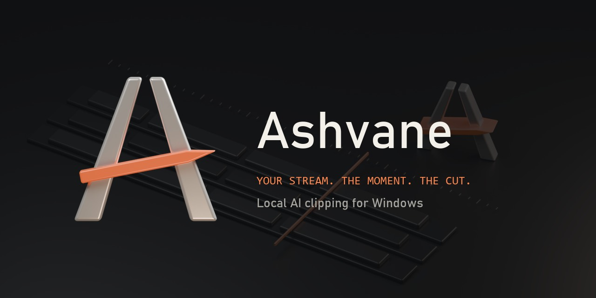
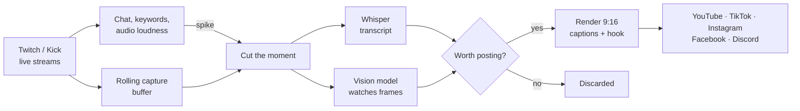
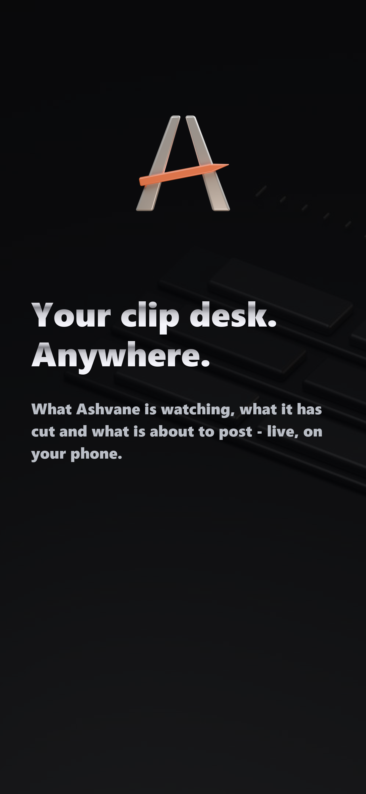
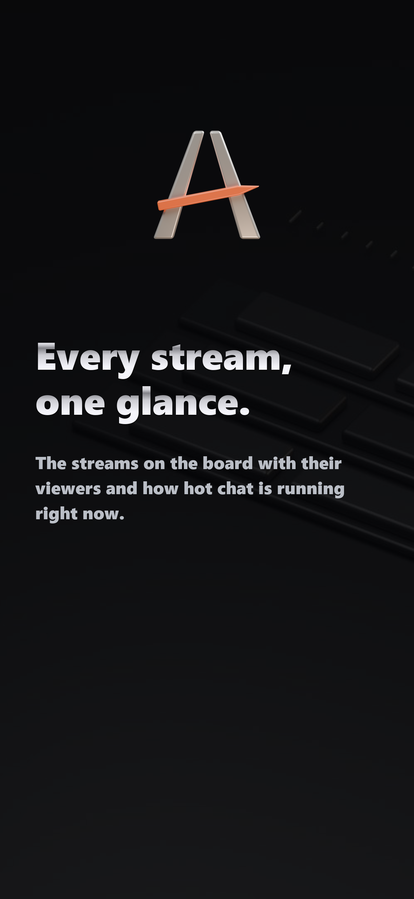
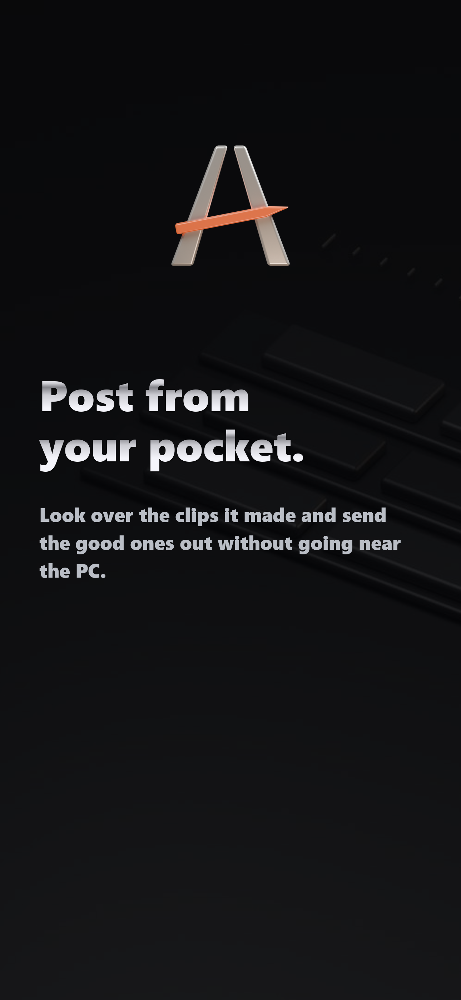
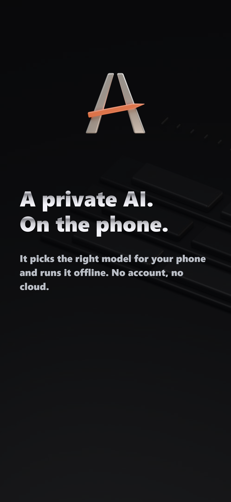
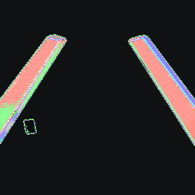

<div align="center">



<h3>Catches the moment chat loses it. Cuts it, captions it, posts it.<br>All on your own PC.</h3>

<p>


</p>

<a href="#install">Install</a> ·
<a href="#how-it-works">How it works</a> ·
<a href="#the-phone-app">Phone app</a> ·
<a href="#accounts-all-free">Connect accounts</a> ·
<a href="CHANGELOG.md">Changelog</a>

</div>

---

**Ashvane** watches the biggest live streams on Twitch and Kick at once. When chat explodes, the
audio jumps or the keywords start flying, it cuts the moment out of a rolling buffer, has a local
AI watch it and decide whether it is actually worth posting, then renders a vertical clip with
word-by-word captions and a hook, writes a title that makes people stop scrolling, and posts it to
YouTube Shorts, TikTok, Instagram Reels, Facebook Reels and Discord on your schedule.

No subscription, no cloud, no API bill. The AI runs on your graphics card through
[Ollama](https://ollama.com), ffmpeg does the editing, and your keys never leave the PC.

<table>
<tr>
<td width="50%" valign="top">

### It watches
Up to 30 streams at once, picked from the top categories or the streamers you name. Chat speed is
compared to each stream's own normal, so a quiet channel's big moment counts as much as a giant's.

### It judges
A vision model looks at frames from the clip, one at the exact spike, and reads the transcript and
chat's reaction. Dead air, keyword false alarms and "chat was just spamming" get rejected.

</td>
<td width="50%" valign="top">

### It edits
1080×1920 with the streamer's facecam stacked over the gameplay, captions that light up word by
word, a hook, punch-in zoom at the spike and loudness levelled. Restyle any clip in the Studio.

### It posts
Per-platform titles, descriptions and hashtags, daily caps, gaps between posts and posting hours.
Slurs are masked on screen and bleeped in the audio before anything goes out.

</td>
</tr>
</table>

## How it works



1. **Detect.** Chat rate, keyword and audio-loudness spikes fire on a live stream.
2. **Cut and check.** The clip is cut from the rolling buffer and thrown out if the capture is black, silent or too short.
3. **Listen.** Whisper writes a timestamped transcript.
4. **Look.** ffmpeg grabs frames across the clip, one exactly at the spike, and the vision model (`qwen3-vl:8b`) describes what is happening, the facecam reaction and any on-screen alerts.
5. **Judge and write.** The model decides between `moment` (post it) and `chat_only`, `keyword_false` or `dead_air` (reject), picks the trim points, then writes titles, descriptions, tags and a first comment for each platform.
6. **Render and post.** A vertical clip with captions, hook and watermark goes out inside your caps and posting hours.

Only one model uses the GPU at a time, so clipping never fights itself. **Settings → AI** picks a
profile for your card automatically (light, balanced or strong) and has every switch and prompt.

## The phone app

<table>
<tr>
<td></td>
<td></td>
<td></td>
<td></td>
</tr>
</table>

**Remote.** The whole desk on your phone over your own Wi-Fi or Tailscale: live streams with
viewers and chat heat, the clips it made, post-now, Studio, every setting, pause and the log.

**Assistant.** A private AI that runs *on the phone*. It checks the phone's memory and chip and
downloads the largest model that will run well, then works offline. Attach photos, videos and
files; send a video link and your PC watches it for the phone. Skills you call with `/name`
(`/research`, `/learn`, `/grill-me`, `/watch-this`, `/plan` and more), your own skills imported
from any `SKILL.md` link, rules that apply to every chat, and a Code mode.

**Locked.** Face ID, Touch ID or your passcode on iPhone; fingerprint, face unlock or PIN on
Android. The phone does the checking; the app never sees it.

iPhone installs through a sideloader (AltStore, SideStore, Feather, Sideloadly) and updates
itself from this repo's feed. Android installs the `.apk` directly. See [phone/README.md](phone/README.md).

## Install

**The easy way.** Run **`Ashvane-Setup-<version>.exe`**. It installs for your Windows account
(no admin), adds Ashvane to the Start menu and optionally the desktop, and can install the free
prerequisites for you: **ffmpeg** and **Ollama**, through winget. The AI models download by
themselves the first time. Updating keeps your settings, keys and clips; uninstall from
Settings → Apps → *Ashvane*, which asks before deleting your data.

**What it needs.** Windows 10 or 11, and an NVIDIA graphics card for comfortable speed (10 GB of
video memory or more is the sweet spot; smaller cards get a lighter AI profile, and it still runs
on the CPU, only slower).

<details>
<summary><b>Build it yourself (developers)</b></summary>

1. Prerequisites: Python 3.12, **ffmpeg** on PATH (`winget install Gyan.FFmpeg`), **Ollama**, and the Edge WebView2 runtime (already on Windows 11).
2. Set up the environment:
   ```
   py -3.12 -m venv .venv
   .venv\Scripts\pip install -r requirements.txt
   ```
3. `build.bat` builds `dist\Ashvane\Ashvane.exe` (PyInstaller, one folder, windowed).
4. `installer\build_installer.bat` builds `dist\Ashvane-Setup-<version>.exe` with Inno Setup 6 (free: `winget install JRSoftware.InnoSetup`).

Your settings, database, tokens, logs, buffers and clips live in `%LOCALAPPDATA%\Ashvane`, so reinstalling or updating never wipes them. You can move the folders under **Settings → App**.

| Command | What runs |
|---|---|
| `python -m clipbot` | Console mode; dashboard at http://127.0.0.1:8787 |
| `python -m clipbot --window` (or `run.bat`) | Native window + tray |
| `python -m clipbot --headless` | Engine + dashboard, no window |
| `python -m pytest -q` | Test suite |
| `python scripts\live_clipability.py` | One real call to your Ollama model |
| `python scripts\e2e_live.py xqc kaicenat` | Real capture → cut → Whisper → AI → render on live channels (no keys needed) |

</details>

## Using it

The app opens behind a password lock with local profiles (salted PBKDF2 hashes, stored only on
this PC), then shows the desk: a sidebar with the live status, backlog meter, GPU, Pause and Lock
pinned at the bottom.

- **Live**: stream monitors with live thumbnails and chat-rate sparklines. Click one to watch exactly what Ashvane is capturing, a few seconds behind live, with chat and the hype gauges.
- **Clips**: everything it cut (ready, posted, rejected, still working). Watch one, see the frames the AI looked at, copy captions, download it, or **Publish now** to any connected platform.
- **Studio**: restyle a clip in seconds. Pick a theme, tweak it, trim it, edit the hook; the phone preview updates instantly and **Use for all new clips** saves the look.
- **Growth**: views and followers per platform, what is performing, and whether the scheduler is steering toward it.
- **System**: **Scan this PC** recommends worker counts, encoder and Whisper device, and **Storage** moves any data folder or spreads clips across drives you pick.
- **Settings**: every threshold, path, prompt, template, style and account, each with a plain-English explanation. Export leaves secrets out unless you ask.
- **Setup**: a checklist of anything missing, with a button that jumps to the right field.
- **Desktop pets**: five little 3D companions (Blip, Ember, Moss, Nib, Glitch) that live on your desktop while it runs and react to clips, posts and spikes. Optional.
- **Backlog failsafe**: when the AI falls behind, capture pauses until the queue drains, so your PC never drowns.

## Privacy

Everything stays on your computer. There is no Ashvane account, no telemetry and no server.
Keys and tokens are encrypted with Windows' own per-user encryption (DPAPI), so copying the
settings file to another PC or account exposes nothing. The phone talks only to your own PC.
Details in [PRIVACY.md](PRIVACY.md).

## Accounts (all free)

Discovery needs free Twitch and/or Kick developer keys; each place you post to needs its own free connection. Open the ones you use.

<details>
<summary><b>Twitch (discovery), Settings → Twitch</b></summary>

1. Go to https://dev.twitch.tv/console/apps and click **Register Your Application**.
2. Name: anything unique. **OAuth Redirect URLs**: `https://localhost`. The form requires HTTPS; Ashvane never opens this URL because it uses an app token (client credentials). Category: *Application Integration*. Client type: **Confidential**. Complete the captcha, then click **Create**.
3. Copy the **Client ID** into `twitch.client_id`. Click **New Secret** and copy it into `twitch.client_secret`.

Chat is read anonymously and needs no keys.

</details>

<details>
<summary><b>Kick (discovery), Settings → Kick</b></summary>

Official guide: https://docs.kick.com/getting-started/kick-apps-setup
1. On kick.com, turn on **Two-Factor Authentication** (Account Settings → Security). The developer tools stay hidden until 2FA is on.
2. Open **Account Settings → Developer** (https://kick.com/settings/developer) and create an app.
3. **OAuth Redirect URIs**: Kick only accepts **HTTPS** addresses. Enter `https://localhost`. Ashvane never opens it, because it signs in with an *App Access Token* (the client-credentials flow, no browser login). Leave no empty extra redirect row, since an empty row also shows "Redirect URIs must use HTTPS protocol."
4. Ashvane only reads public livestream and channel data, which the App Access Token covers without any user scopes. If the form insists on at least one scope, a read-only one such as `user:read` or `channel:read` is fine.
5. Copy the **Client ID** into `kick.client_id` and the **Client Secret** into `kick.client_secret`, then **Save**. The Live tab's Kick line should change from "no client ID/secret" to "N streams selected" within one refresh (45 s).

Kick chat needs no keys. It is read anonymously through Kick's public websocket, the same way kick.com does. If Kick's website blocks the chatroom lookup (Cloudflare), that monitor shows "chat unavailable" and still clips from audio spikes.

</details>

<details>
<summary><b>YouTube Shorts, Settings → Accounts</b></summary>

1. In https://console.cloud.google.com create a project and enable **YouTube Data API v3**.
2. Under **OAuth consent screen**, choose External and add yourself as a test user.
3. Under **Credentials**, choose Create credentials → OAuth client ID → **Desktop app**.
4. Copy the client ID into `accounts.youtube_client_id` and the secret into `accounts.youtube_client_secret`, then **Save**.
5. Click **Connect YouTube** at the top of the Accounts section and sign in within your browser.
6. Turn on **Settings → Posting → YouTube → Post to YouTube**.

Unverified apps get a small daily upload quota. The default daily cap of 6 stays inside it.

</details>

<details>
<summary><b>TikTok, Settings → Accounts (about 30 minutes, plus waiting for TikTok's review)</b></summary>

TikTok is the strictest platform. It needs a **verified website** with Terms and Privacy pages and an **https** sign-in redirect, and until it audits your app it only posts **privately**. Ashvane ships that website ready-made in the `tiktok-site` folder.

**A. Put the website online (free, GitHub Pages)**
1. Create a free account at https://github.com. Make a new **public** repository named `clipbot`.
2. In the repository click **Add file → Upload files**. Drag in everything inside this repo's `tiktok-site` folder: `index.html`, `terms.html`, `privacy.html` and the `callback` folder. Then click **Commit changes**.
3. Open **Settings → Pages**. Under *Build and deployment* pick **Deploy from a branch**, branch **main**, folder **/ (root)**, then **Save**. After about a minute the site is live at `https://YOURNAME.github.io/clipbot/`.
   Your URLs will be:
   - Website: `https://YOURNAME.github.io/clipbot/`
   - Terms: `https://YOURNAME.github.io/clipbot/terms.html`
   - Privacy: `https://YOURNAME.github.io/clipbot/privacy.html`
   - Redirect URI: `https://YOURNAME.github.io/clipbot/callback/` (keep the trailing `/`)

**B. Create the TikTok app**
1. Sign in at https://developers.tiktok.com with your TikTok account, then open **Manage apps → Connect an app** (register it under your individual account).
2. **Basic information**: upload an app icon (1024×1024 PNG; `assets\clipbot.png` scaled up works), enter a name and a description, pick a category, and paste the **Terms of Service URL** and **Privacy Policy URL** from step A.
3. **Platforms**: tick **Web** and enter the **Website URL**. Click **Verify** and choose **URL prefix** (`https://YOURNAME.github.io/clipbot/`). TikTok gives you a small signature `.txt` file: upload it to the same GitHub repository (Add file → Upload files → Commit), wait a minute, and click **Verify** again. Do the same for the Terms and Privacy URLs if TikTok asks.
4. **Products → Add products**: add **Login Kit** and **Content Posting API**. In the Content Posting API settings turn on **Direct Post**.
5. **Login Kit → Redirect URI**: add `https://YOURNAME.github.io/clipbot/callback/` exactly.
6. **Scopes**: make sure `user.info.basic`, `video.upload` and `video.publish` are listed.
7. Copy the **Client key** and **Client secret** from the top of the app page.

**C. Connect Ashvane**
1. Settings → Accounts: paste the key into `tiktok_client_key`, the secret into `tiktok_client_secret`, and the redirect into `tiktok_redirect_uri`, **exactly** as registered. Click **Save**.
2. Click **Connect TikTok**. Your browser opens TikTok; approve the app. The callback page sends you straight back to Ashvane, which shows "TikTok connected".
   If the page just shows an address instead, copy it and paste it into **"TikTok didn't come back to Ashvane?"** under the Connect buttons, then click **Finish TikTok connect**.
3. Turn on **Settings → Posting → TikTok → Post to TikTok**.

**D. Until TikTok audits your app** (this is TikTok's rule, not Ashvane's)
- Posts can only be **private**. Keep **Posting → TikTok → Privacy** on `SELF_ONLY`.
- Your TikTok account itself must be set to **Private** (TikTok app → Settings and privacy → Privacy → Private account). Otherwise uploads fail with `unaudited_client_can_only_post_to_private_accounts`.
- To go public: in the developer portal, fill in **App review** (explain that the app posts your own edited clips), upload a short screen recording of Ashvane posting (TikTok requires at least one demo video), and click **Submit for review**. When it is approved, switch your account back to public and set Privacy to `PUBLIC_TO_EVERYONE`.

</details>

<details>
<summary><b>Instagram Reels, Settings → Accounts (about 10 minutes)</b></summary>

You only need **one token**. Ashvane looks up your account ID and renews the token by itself (the renewal interval is **Posting → Instagram → Refresh token after**).
1. **Make the account professional**: Instagram app → Settings and activity → Account type and tools → **Switch to professional account** (Creator or Business, both free).
2. Go to https://developers.facebook.com/apps, log in with Facebook, and click **Create app**. When asked for the type or use case, choose **Business** (a new Business app is required). Name it `Ashvane`.
3. In the app's left menu open **Instagram → API setup with Instagram business login**.
4. Under **Generate access tokens**, click **Add account** and log in to the Instagram account you post to. If Instagram shows a *tester invite*, accept it (instagram.com → Settings → Apps and websites → Tester invites), then come back.
5. Click **Generate token** next to the account, approve the permissions (they include `instagram_business_basic` and `instagram_business_content_publish`) and **copy the token**. It lasts 60 days, and Ashvane keeps renewing it.
6. Settings → Accounts: paste it into **Instagram access token**. Leave *Instagram user ID* empty. Click **Save**.
7. Turn on **Settings → Posting → Instagram → Post to Instagram**.

Posting to your own account works while the Meta app stays in Development mode, so no App Review is needed. Instagram allows 100 API posts per 24 h; Ashvane's default cap is 25.

</details>

<details>
<summary><b>Facebook Page Reels, Settings → Accounts (about 10 minutes)</b></summary>

Reels go to a **Facebook Page** you manage, not a personal profile. Create a free Page first at facebook.com/pages/create if you have none.
1. In the same Meta app (developers.facebook.com/apps → Ashvane), click **Add use case** and add the one for **managing Pages / Pages API**, so the Page permissions become available.
2. Open the **Graph API Explorer**: https://developers.facebook.com/tools/explorer
   - **Meta App**: pick `Ashvane`. **User or Page**: *User Token*.
   - Under **Permissions**, add `pages_show_list`, `pages_read_engagement`, `pages_manage_posts` (and `pages_manage_metadata` if it is listed).
   - Click **Generate Access Token** and approve it for your Page.
3. **Make it long-lived**: click the blue ⓘ next to the token → **Open in Access Token Tool** (or go to https://developers.facebook.com/tools/debug/accesstoken and paste it) → scroll down → **Extend Access Token** → copy the new token.
4. Back in the Graph API Explorer, paste that long-lived token into the *Access Token* box, type `me/accounts` in the query field, and click **Submit**.
5. In the result, find your Page and copy:
   - `"id"` → Settings → Accounts → **Facebook Page ID**
   - `"access_token"` → **Facebook Page token**. A Page token made from a long-lived user token does not expire.
6. **Save**, then turn on **Settings → Posting → Facebook → Post to Facebook**.

Facebook accepts Reels 3–90 s long at 9:16, which is what Ashvane renders.

</details>

<details>
<summary><b>Discord, Settings → Accounts</b></summary>

In the Discord channel, open Edit Channel → Integrations → Webhooks → **New Webhook** → **Copy Webhook URL**. Paste it into `accounts.discord_webhook`. Clips up to 24 MB are attached; larger ones are sent as text.

</details>

<details>
<summary><b>Whisper on the GPU</b></summary>

If the dashboard shows Whisper as `cpu … CUDA failed: cublas64_12.dll is not found`, install the CUDA libraries into the venv:
```
.venv\Scripts\pip install nvidia-cublas-cu12 nvidia-cudnn-cu12
```
Ashvane adds their DLL folders automatically. For the installed exe, run `build.bat` again afterwards so they get bundled. Whisper keeps working on the CPU until then; it is just slower.

</details>

## Made in Blender



The mark, the animated splash and the desk backdrop are original 3D renders, made in
[Blender](https://www.blender.org) (free) from a single script: [`art/ashvane_scene.py`](art/ashvane_scene.py).
Two satin-metal vanes lean into an A, and an ember slash cuts through where the crossbar would be.
The same outlines are drawn flat in [`clipbot/icon.py`](clipbot/icon.py) so the 16-pixel tray icon
matches the render exactly.

```
.venv\Scripts\python art\build_art.py --render
```

That renders everything and packages it: app icon, splash, backdrop, phone icons and launch
screen, store pictures and the brand kit for channel avatars and banners. Blender is found through
the `BLENDER` environment variable, then PATH, then the default install folder. Add `--fast` for
quick previews.

<br clear="right">

## Layout

```
clipbot/config.py        every setting (the Settings form is generated from it)
clipbot/discovery.py     Twitch Helix + Kick public API stream selection
clipbot/capture.py       streamlink → ffmpeg rolling segment buffers
clipbot/chat.py          anonymous Twitch IRC + Kick chat
clipbot/detector.py      chat / keyword / audio spike detection
clipbot/assembler.py     cut + quality check
clipbot/transcribe.py    faster-whisper with CUDA → CPU fallback
clipbot/vision.py        the vision model: frames → what happened
clipbot/clipability.py   the judge (JSON verdicts)
clipbot/copywriter.py    titles, descriptions, tags per platform
clipbot/editor.py        9:16 render, captions, hook, watermark
clipbot/publishers/      YouTube, TikTok, Instagram, Facebook, Discord + OAuth
clipbot/scheduler.py     caps, gaps, posting window, retention
clipbot/pipeline.py      orchestration + backlog failsafe
clipbot/agent/           what the PC does for the phone's assistant
clipbot/dashboard/       FastAPI server + the desktop UI
clipbot/desktop.py       window, tray, single instance, restart
phone/                   the iPhone / Android app (Expo, React Native)
art/                     Blender scenes and the packaging script
installer/               Inno Setup installer, release and sideload-feed tools
```

## License, terms and privacy

Free and open source under the **GNU AGPL v3.0** ([LICENSE](LICENSE)). Using it means agreeing to
[TERMS.md](TERMS.md): you are responsible for having the right to post clips and for following each
platform's rules. Everything runs locally; see [PRIVACY.md](PRIVACY.md). Third-party credits:
[NOTICE.md](NOTICE.md). Not affiliated with Twitch, Kick, YouTube, TikTok, Meta or Discord.
